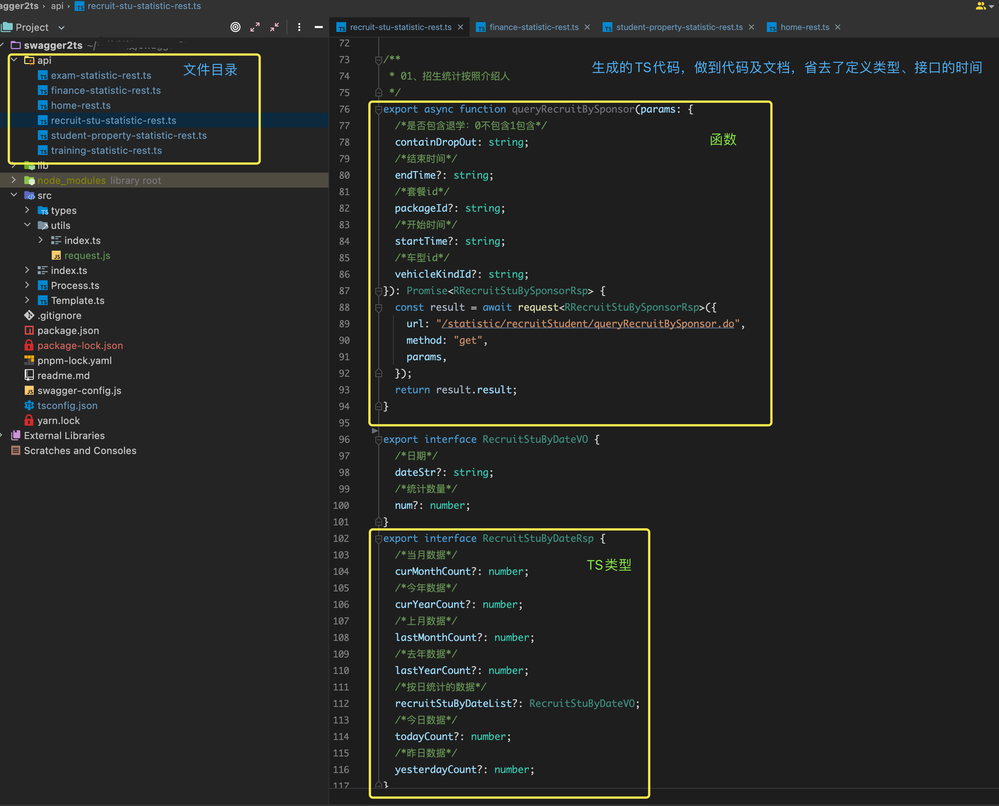

<h2 align = "center">Install</h2>


#### Install with npm:
```
npm i swagger-ts-duolun
```
#### Install with yarn:
```
yarn add swagger-ts-duolun
```

<h2 align = "center">Config</h2>

```javascript
// 根目录新建swagger-config配置文件，配置如下

module.exports = {
    //ts版本｜js版本 
    type: "ts",
    api: {
        
        //swagger-api地址
        swaggerUrl: 'http://192.168.1.149:8083/v2/api-docs?group=%E7%AE%A1%E7%90%86%E7%89%88app%E6%8E%A5%E5%8F%A3',

        //生成的文件地址
        dir: './api',

        //头部文件包自定义
        topPackagesStr: [
            'import request from "@/utils/request"',
        ],

        //需要生成的controller,匹配controller名，默认全部
        include: ['finance-statistic-rest'],

        //需要忽略的controller,默认全部忽略
        exclude: [],
    }
}

/***********************************************************************************************/

// package.json添加配置
{
    "api"："node ./node_modules/swagger-api/lib/index.js "
}
```
<h2 align = "center">Result</h2>

#### Usage method：


#### Generated code：



